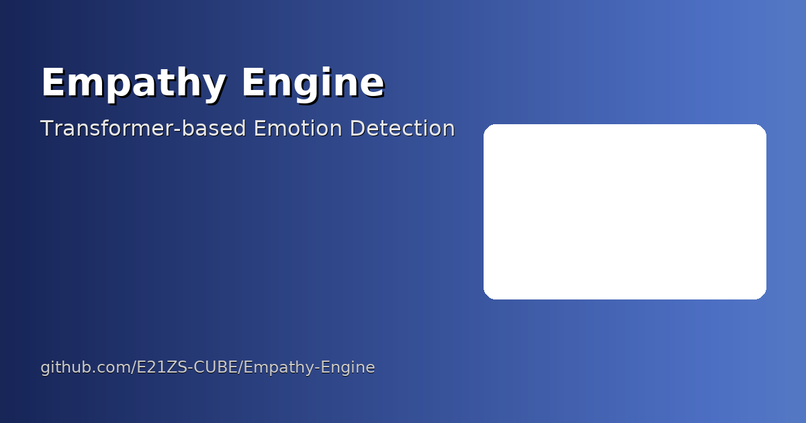

<!-- last updated: 2025-12-04 -->
<!-- Premium Animated GitHub Profile README for Malla Jaswanth Narayana -->

<!-- HEADER: animated capsule + typing -->

  

  

  

# Hi 👋, I'm Malla Jaswanth Narayana
**Aerospace Engineering student @ IIT Bombay** • Minor in Management  
AI/ML • NLP • Web Development • Community Growth • Product Strategy

  
  
  

---

## 🔭 What I do
- Build and deploy AI / NLP systems and full-stack web apps.  
- Lead and scale technical communities (8k+ aspirants).  
- Design engineering & CSR strategies for student teams and competitions.

---

## 🧰 Tech Stack

  
  
  
  
  
  
  
  
  

---

## 🔥 Featured Projects

  <!-- Empathy Engine -->
  

    
    
<strong>Empathy Engine</strong> <small>Transformer-based Emotion Detection</small>

  

  <!-- AI Communication Scorer -->
  

    
    
<strong>AI Communication Scorer</strong> <small>Audio analytics for verbal skills</small>

  

  <!-- Internet Shutdown UI -->
  

    
    
<strong>Internet Shutdown UI</strong> <small>Real-time connectivity dashboard</small>

  

📌 Thumbnails are served from <code>assests/</code>. Keep them 1200×630 for best quality.

---

## 💼 Experience (snapshot)
**Assistant Manager** — IIT Bombay Racing  
- Built the team website, managed sponsors & CSR partnerships.

**Community Manager** — JEEsociety  
- Scaled community to 8,000+ aspirants; revenue-driven content.

**Growth & Strategy Intern** — AptiDude  
- Pitch decks and retention optimization.

---

## 🏆 Select Achievements
- JEE Main — **99.35 percentile**  
- JEE Advanced — **Top 4%**  
- NEST — **Top 0.36%**  
- COMEDK — **Top 0.11%**

---

## 📈 GitHub Stats

  

  

---

## 📫 Connect
- **Email** — narayanamalla0008@gmail.com  
- **LinkedIn** — https://linkedin.com/in/jaswanthnarayana  
- **GitHub** — https://github.com/narayanamalla

---

  

